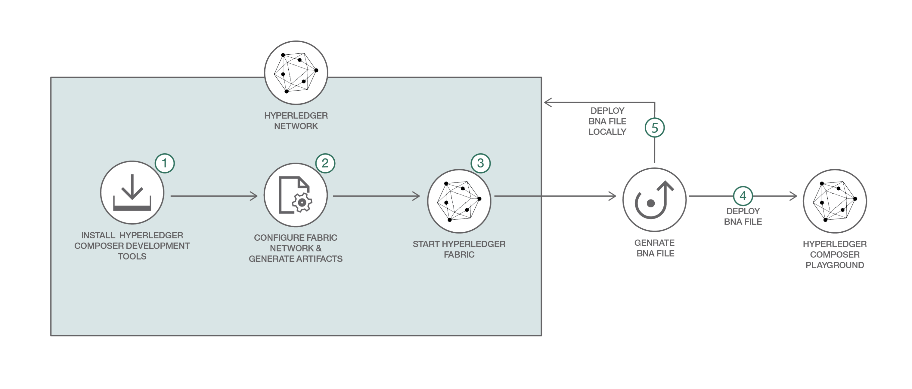

# BlockchainPublicRegulationFabric-Food

In this journey, we capture the regulatory compliance logic for the Food Supplier Verification Program in a smart contract deployed on a business network.

This business network defines:

**Participants:**
`Supplier` `Importer` `Retailer` `Regulator`

**Assets:**
`ProductListingContract`

**Transactions:**
`createProductListing` `transferListing` `checkProducts` `updateExemptedList`

Initially, the supplier will transfer the food products to an importer who verifies whether the supplier, country, and food type all match with the correct identifiers. At port of entry, the supplier is checked against a list of known suppliers in a database (managed by the regulator). If the supplier is of type exempt, then the products are then transferred to the retailer. If the supplier is of type non-exempt, then the products are checked against a list of known food products in the database (managed by the regulator). If the food is exempt product then transfer it to the retailer. If the food is a non-exempt product, the importer must conduct a harms analysis (either independently, or using a third-party). The supplier provides the harms analysis report to the regulator. The regulator reviews compliance attestation and transfers the products to the retailer.

The `createProductListing` function is called when an `createProductListing` transaction is submitted. The logic allows a supplier to create a `ProductListingContract` asset.

The `transferListing` function is called when a `transferListing` transaction is submitted by the owner of `ProductListingContract`. It is submitted either by `Supplier` to transfer `ProductListingContract` to `Importer` or by `Importer` to transfer `ProductListingContract` to `Retailer` when the exempt check for the products is completed.

The `checkProducts` function is called when a `checkProducts` transaction is submitted by the `Supplier` to perform the exempt check for the products present in the `ProductListingContract`. The status of `ProductListingContract` contract will change to `CHECKCOMPLETED` if all all the products are exempted else the status will change to `HAZARDANALYSISCHECKREQ`. `HAZARDANALYSISCHECKREQ` means the `Supplier` needs to provide Hazard Analysis report for the products. After submitting the report `Supplier` performs the `checkProducts` transaction to complete the exempt check for the products.

The `updateExemptedList` function is called when a `updateExemptedList` transaction is submitted by the `Regulator` to update the list of exempted Orgs ids and Product ids.

## Included Components
* Hyperledger Fabric
* Hyperledger Composer

## Included technologies
* Blockchain
* Containers
* Cloud

## Application Workflow Diagram


* Install Hyperledger Composer development tools
* Configure and start Hyperledger Fabric network
* Generate the Business Network Archive file
* Deploy the Business Network Archive using Composer Playground
* (Alternative method) Deploy the Business Network Archive on Hyperledger Composer running locally

## Prerequisites

* [Docker](https://www.docker.com/products/overview) - v1.13 or higher
* [Docker Compose](https://docs.docker.com/compose/overview/) - v1.8 or higher
* [Node.js & npm](https://nodejs.org/en/download/) - node v6.2.0 - v6.10.0 (v7+ not supported); npm comes with your node installation.
* [Git client](https://git-scm.com/downloads) - needed for clone commands
*  git - 2.9.x
*  Python - 2.7.x


## Steps
1. [Installing Hyperledger Composer Development Tools](#1-installing-hyperledger-composer-development-tools)
2. [Starting Hyperledger Fabric](#2-starting-hyperledger-fabric)
3. [Generate the Business Network Archive (BNA)](#3-generate-the-business-network-archive-bna)
4. [Deploy the Business Network Archive on Hyperledger Composer running locally](#3-deploy-the-business-network-archive-on-hyperledger-composer-running-locally)

## 1. Installing Hyperledger Composer Development Tools

**Note:** You may need to run these commands in superuser `sudo` mode. `sudo` allows a permitted user to execute a command as the superuser or another user, as specified by the security policy.

* The `composer-cli` contains all the command line operations for developing business networks. To install `composer-cli` run the following command:
```
npm install -g composer-cli@0.16.0
```

* The `generator-hyperledger-composer` is a Yeoman plugin that creates bespoke (e.g. customized) applications for your business network. Yeoman is an open source client-side development stack, consisting of tools and frameworks intended to help developers build web applications. To install `generator-hyperledger-composer` run the following command:
```
npm install -g generator-hyperledger-composer@0.16.0
```

* The `composer-rest-server` uses the Hyperledger Composer LoopBack Connector to connect to a business network, extract the models and then present a page containing the REST APIs that have been generated for the model. To install `composer-rest-server` run the following command:
```
npm install -g composer-rest-server@0.16.0
```

* When combining `Yeoman` with the `generator-hyperledger-composer` component, it can interpret business networks and generate applications based on them. To install `Yeoman` run the following command:
```
npm install -g yo@2.0.0
```

## 2. Starting Hyperledger Fabric

First download the docker files for Fabric in preparation for creating a Composer profile.  Hyperledger Composer uses Connection Profiles to connect to a runtime. A Connection Profile is a JSON document that lives in the user's home directory (or may come from an environment variable) and is referenced by name when using the Composer APIs or the Command Line tools. Using connection profiles ensures that code and scripts are easily portable from one runtime instance to another.

Start the Fabric and create a Composer profile using the following commands:
```bash
./downloadFabric.sh
./startFabric.sh
./createPeerAdminCard.sh
```  

No need to do it now; however as an fyi - you can stop and tear down Fabric using:
```
./stopFabric.sh
./teardownFabric.sh
```

## 3. Generate the Business Network Archive (BNA)

To check that the structure of the files is valid, you can now generate a Business Network Archive (BNA) file for your business network definition. The BNA file is the deployable unit -- a file that can be deployed to the Composer runtime for execution.

Use the following command to generate the network archive:
```bash
npm install
```
You should see the following output:
```bash
Creating Business Network Archive

Looking for package.json of Business Network Definition
	Input directory: /Users/ishan/Documents/git-demo/BlockchainPublicRegulationFabric-Food

Found:
	Description: Sample food supplier verification network
	Name: food-supply
	Identifier: food-supply@0.0.1

Written Business Network Definition Archive file to
	Output file: ./dist/food-supply.bna

Command succeeded
```
The `composer archive create` command has created a file called `food-supply.bna` in the `dist` folder.

You can test the business network definition against the embedded runtime that stores the state of 'the blockchain' in-memory in a Node.js process.
From your project working directory, open the file test/foodTest.js and run the following command:
```
npm test
```
You should see the following output :
```
> food-supply@0.0.1 test /Users/ishan/Documents/git-demo/BlockchainPublicRegulationFabric-Food
> mocha --recursive

  FoodSupply - Test
    #FSVP
      ✓ Create Participants (185ms)
      ✓ Transfer ProductListing to Importer
      ✓ Exempt Check for ProductListing (41ms)
      ✓ Transfer ProductListing to Retailer (56ms)

  4 passing (1s)
```

## 4. Deploy the Business Network Archive on Hyperledger Composer running locally

Please start the local Fabric using the [instructions](https://github.com/IBM/BlockchainNetwork-CompositeJourney#2-starting-hyperledger-fabric).
Now change directory to the `dist` folder containing `food-supply.bna` file and type:
```
cd dist
composer runtime install --card PeerAdmin@hlfv1 --businessNetworkName food-supply
composer network start --card PeerAdmin@hlfv1 --networkAdmin admin --networkAdminEnrollSecret adminpw --archiveFile food-supply.bna --file networkadmin.card
composer card import --file networkadmin.card
```

You can verify that the network has been deployed by typing:
```
composer network ping --card admin@food-supply
```

You should see the the output as follows:
```
The connection to the network was successfully tested: food-supply
	version: 0.16.0
	participant: org.hyperledger.composer.system.NetworkAdmin#admin

Command succeeded
```

To create the REST API we need to launch the `composer-rest-server` and tell it how to connect to our deployed business network.
Now launch the server by changing directory to the `BlockchainPublicRegulationFabric-Food` folder and type:
```bash
cd ..
composer-rest-server
```

Answer the questions posed at startup. These allow the composer-rest-server to connect to Hyperledger Fabric and configure how the REST API is generated.
* Enter `admin@food-supply` as the card name.
* Select `never use namespaces` when asked whether to use namespaces in the generated API.
* Select `No` when asked whether to secure the generated API.
* Select `Yes` when asked whether to enable event publication.
* Select `No` when asked whether to enable TLS security.

**Test REST API**

If the composer-rest-server started successfully you should see these two lines are output:
```
Web server listening at: http://localhost:3000
Browse your REST API at http://localhost:3000/explorer
```

Open a web browser and navigate to http://localhost:3000/explorer

You should see the LoopBack API Explorer, allowing you to inspect and test the generated REST API. Follow the instructions to test Business Network Definition as mentioned above in the composer section.


## Additional Resources
* [Hyperledger Fabric Docs](http://hyperledger-fabric.readthedocs.io/en/latest/)
* [Hyperledger Composer Docs](https://hyperledger.github.io/composer/introduction/introduction.html)


## License
[Apache 2.0](LICENSE)
